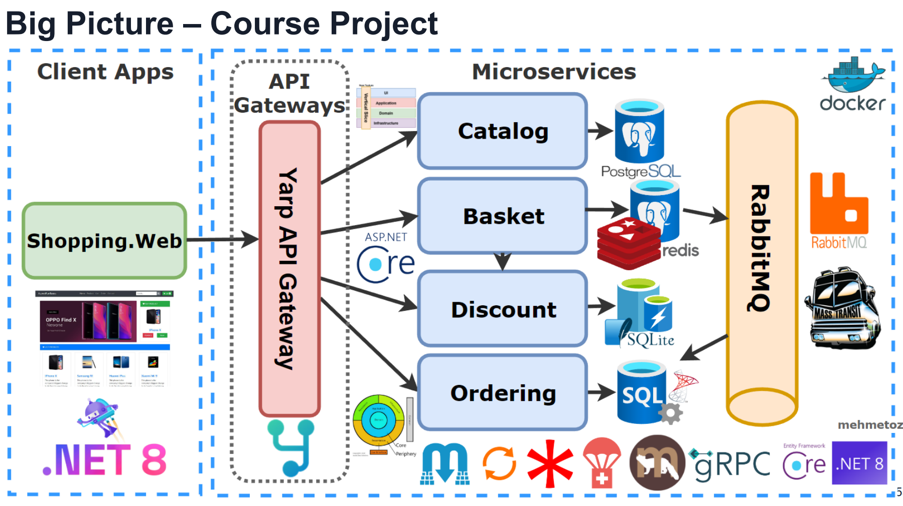
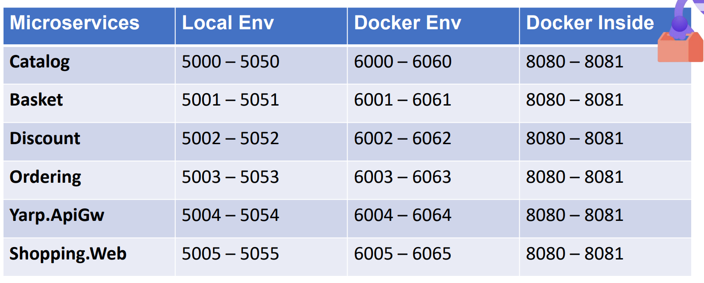

# .NET 8 Microservices: DDD, CQRS, Vertical/Clean Architecture
Develop Microservices on .NET 8 used ASP.NET Web API, Docker, RabbitMQ, MassTransit, gRPC, Yarp Gateway, Redis,SqlServer

https://www.udemy.com/course/microservices-architecture-and-implementation-on-dotnet/

* ASPNET Core 8 Web API Development of Microservices
* ASPNET Minimal APIs and latest features of .Net8 and C# 12
* Vertical Slice Architecture implementation with Feature folders
* CQRS implementation using MediatR library
* CQRS Validation Pipeline Behaviours with MediatR and FluentValidation
* Marten library for .NET Transactional Document DB on PostgreSQL
* Carter Library for Minimal API endpoint definition
* Using Redis as a Distributed Cache over Basketdb
* Implements Proxy, Decorator and Cache-aside Design Patterns
* Build a Highly Performant inter-service gRPC Communication with Basket Microservice
* Consume Discount Grpc Service for inter-service sync communication to calculate product final price
* Publish BasketCheckout Queue with using MassTransit and RabbitMQ
* PostgreSQL database connection and containerization
* Implementing DDD, CQRS, and Clean Architecture with using Best Practices
* Tactical Domain-Driven Design: Entities, Value Objects, Aggregates, Agg. Roots
* Developing CQRS with using MediatR, FluentValidation and Mapster packages
* Using Entity Framework Core ORM and auto migrate to SqlServer when application startup
* Entity Framework Core Code-First Approach, Migrations, DDD Entity Configurations in Clean Architecture implementation
* Async Microservices Communication with RabbitMQ Message-Broker Service
* Using RabbitMQ Publish/Subscribe Topic Exchange Model
* Consuming RabbitMQ BasketCheckout event queue with using MassTransit-RabbitMQ Configuration
* Using MassTransit for abstraction over RabbitMQ Message-Broker system
* API Gateways with Yarp Reverse Proxy applying Gateway Routing Pattern
* Yarp Reverse Proxy Configuration; Route, Cluster, Path, Transform, Destinations
* Rate Limiting with FixedWindowLimiter on Yarp Reverse Proxy Configuration
* ASPNET Core Web Application with Bootstrap 4 and Razor template
* Consume YarpApiGateway APIs using Refit Library with Generated HttpClientFactory
* Cross-cutting concerns Logging, global Exception Handling and Health Checks
* Dockerfile and docker-compose file for running Multi-container Docker environment

